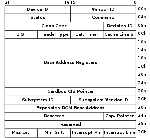

# Realtek8139-driver
A network device-driver for Realtek-8139 chipset, built to work on `Linux 2.4.18`.

* Setup [linux-2.4.18](https://kernel.ubuntu.com/~kernel-ppa/mainline/), preferably in a VM.
* Compile the driver with `make`
* Load the module into the kernel: `sudo insmod realtk8139.ko`

Since the chipset is pretty old and quite cheap, it would be convenient to assume that the system does not already have such a driver (I didn't). If that's not the case, please refrain from using this module (might result in unspecified behaviour).

My attempt at learning device-driver/kernel-module programming.

### PCI Configuration Space

### References
* Linux Device Drivers, by Jonathan Corbet, Alessandro Rubini
* linuxgazette.net
